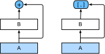
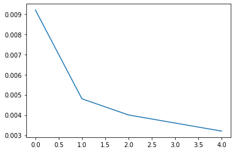
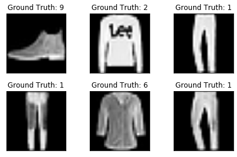
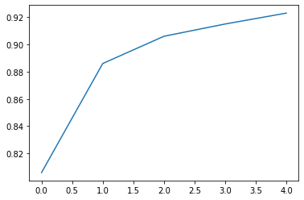

# DenseNet
The key difference between ResNet and DenseNet is that in the latter case outputs are concatenated rather than added. As a result we perform a mapping from x to its values after applying an increasingly complex sequence of functions.$$x → [x, f 1 (x), f 2 (x, f 1 (x)), f 3 (x, f 1 (x), f 2 (x, f 1 (x)), . . .]$$

In the end, all these functions are combined in an MLP to reduce the number of features again. In terms of implementation this is quite simple - rather than adding terms, we concatenate them. The name DenseNet arises from the fact that the dependency graph between variables becomes quite dense. The last layer of such a chain is densely connected to all previous layers. The main components that compose a DenseNet are dense blocks and transition layers. The former defines how the inputs and outputs are concatenated, while the latter controls the number of channels so that it is not too large.
# Model

# loss

# 	Prediction

# Train Curve

# Network
<code>
	Sequential(
  (0): Reshape()
  (1): Conv2d(1, 64, kernel_size=(7, 7), stride=(2, 2), padding=(3, 3))
  (2): BatchNorm2d(64, eps=1e-05, momentum=0.1, affine=True, track_running_stats=True)
  (3): ReLU()
  (4): MaxPool2d(kernel_size=3, stride=2, padding=1, dilation=1, ceil_mode=False)
  (5): DenseBlock(
    (net): Sequential(
      (0): Sequential(
        (0): BatchNorm2d(64, eps=1e-05, momentum=0.1, affine=True, track_running_stats=True)
        (1): ReLU()
        (2): Conv2d(64, 32, kernel_size=(3, 3), stride=(1, 1), padding=(1, 1))
      )
      (1): Sequential(
        (0): BatchNorm2d(96, eps=1e-05, momentum=0.1, affine=True, track_running_stats=True)
        (1): ReLU()
        (2): Conv2d(96, 32, kernel_size=(3, 3), stride=(1, 1), padding=(1, 1))
      )
      (2): Sequential(
        (0): BatchNorm2d(128, eps=1e-05, momentum=0.1, affine=True, track_running_stats=True)
        (1): ReLU()
        (2): Conv2d(128, 32, kernel_size=(3, 3), stride=(1, 1), padding=(1, 1))
      )
      (3): Sequential(
        (0): BatchNorm2d(160, eps=1e-05, momentum=0.1, affine=True, track_running_stats=True)
        (1): ReLU()
        (2): Conv2d(160, 32, kernel_size=(3, 3), stride=(1, 1), padding=(1, 1))
      )
    )
  )
  (6): Sequential(
    (0): BatchNorm2d(192, eps=1e-05, momentum=0.1, affine=True, track_running_stats=True)
    (1): ReLU()
    (2): Conv2d(192, 96, kernel_size=(1, 1), stride=(1, 1))
    (3): AvgPool2d(kernel_size=2, stride=2, padding=0)
  )
  (7): DenseBlock(
    (net): Sequential(
      (0): Sequential(
        (0): BatchNorm2d(96, eps=1e-05, momentum=0.1, affine=True, track_running_stats=True)
        (1): ReLU()
        (2): Conv2d(96, 32, kernel_size=(3, 3), stride=(1, 1), padding=(1, 1))
      )
      (1): Sequential(
        (0): BatchNorm2d(128, eps=1e-05, momentum=0.1, affine=True, track_running_stats=True)
        (1): ReLU()
        (2): Conv2d(128, 32, kernel_size=(3, 3), stride=(1, 1), padding=(1, 1))
      )
      (2): Sequential(
        (0): BatchNorm2d(160, eps=1e-05, momentum=0.1, affine=True, track_running_stats=True)
        (1): ReLU()
        (2): Conv2d(160, 32, kernel_size=(3, 3), stride=(1, 1), padding=(1, 1))
      )
      (3): Sequential(
        (0): BatchNorm2d(192, eps=1e-05, momentum=0.1, affine=True, track_running_stats=True)
        (1): ReLU()
        (2): Conv2d(192, 32, kernel_size=(3, 3), stride=(1, 1), padding=(1, 1))
      )
    )
  )
  (8): Sequential(
    (0): BatchNorm2d(224, eps=1e-05, momentum=0.1, affine=True, track_running_stats=True)
    (1): ReLU()
    (2): Conv2d(224, 112, kernel_size=(1, 1), stride=(1, 1))
    (3): AvgPool2d(kernel_size=2, stride=2, padding=0)
  )
  (9): DenseBlock(
    (net): Sequential(
      (0): Sequential(
        (0): BatchNorm2d(112, eps=1e-05, momentum=0.1, affine=True, track_running_stats=True)
        (1): ReLU()
        (2): Conv2d(112, 32, kernel_size=(3, 3), stride=(1, 1), padding=(1, 1))
      )
      (1): Sequential(
        (0): BatchNorm2d(144, eps=1e-05, momentum=0.1, affine=True, track_running_stats=True)
        (1): ReLU()
        (2): Conv2d(144, 32, kernel_size=(3, 3), stride=(1, 1), padding=(1, 1))
      )
      (2): Sequential(
        (0): BatchNorm2d(176, eps=1e-05, momentum=0.1, affine=True, track_running_stats=True)
        (1): ReLU()
        (2): Conv2d(176, 32, kernel_size=(3, 3), stride=(1, 1), padding=(1, 1))
      )
      (3): Sequential(
        (0): BatchNorm2d(208, eps=1e-05, momentum=0.1, affine=True, track_running_stats=True)
        (1): ReLU()
        (2): Conv2d(208, 32, kernel_size=(3, 3), stride=(1, 1), padding=(1, 1))
      )
    )
  )
  (10): Sequential(
    (0): BatchNorm2d(240, eps=1e-05, momentum=0.1, affine=True, track_running_stats=True)
    (1): ReLU()
    (2): Conv2d(240, 120, kernel_size=(1, 1), stride=(1, 1))
    (3): AvgPool2d(kernel_size=2, stride=2, padding=0)
  )
  (11): DenseBlock(
    (net): Sequential(
      (0): Sequential(
        (0): BatchNorm2d(120, eps=1e-05, momentum=0.1, affine=True, track_running_stats=True)
        (1): ReLU()
        (2): Conv2d(120, 32, kernel_size=(3, 3), stride=(1, 1), padding=(1, 1))
      )
      (1): Sequential(
        (0): BatchNorm2d(152, eps=1e-05, momentum=0.1, affine=True, track_running_stats=True)
        (1): ReLU()
        (2): Conv2d(152, 32, kernel_size=(3, 3), stride=(1, 1), padding=(1, 1))
      )
      (2): Sequential(
        (0): BatchNorm2d(184, eps=1e-05, momentum=0.1, affine=True, track_running_stats=True)
        (1): ReLU()
        (2): Conv2d(184, 32, kernel_size=(3, 3), stride=(1, 1), padding=(1, 1))
      )
      (3): Sequential(
        (0): BatchNorm2d(216, eps=1e-05, momentum=0.1, affine=True, track_running_stats=True)
        (1): ReLU()
        (2): Conv2d(216, 32, kernel_size=(3, 3), stride=(1, 1), padding=(1, 1))
      )
    )
  )
  (12): BatchNorm2d(248, eps=1e-05, momentum=0.1, affine=True, track_running_stats=True)
  (13): ReLU()
  (14): AdaptiveMaxPool2d(output_size=(1, 1))
  (15): Flatten()
  (16): Linear(in_features=248, out_features=10, bias=True)
)
</code>