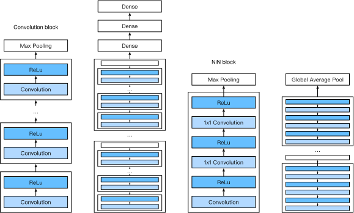
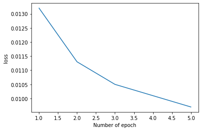
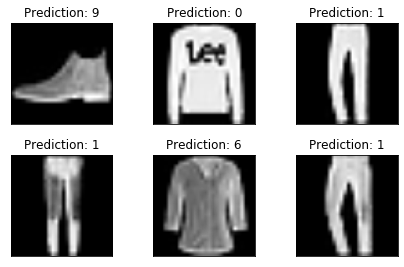

# Network In Network (NIN)
the inputs and outputs of convolutional layers consist of four-dimensional arrays with axes corresponding to the batch, channel, height, and width. Also recall that the inputs and outputs of fully-connected layers are typically two-dimensional arrays corresponding to the batch, and features. The idea behind NiN is to apply a fully-connected layer at each pixel location (for each height and width). If we tie the weights across each spatial location, we could think of this as a $1\times 1$ convolutional layer (as described in :numref:chapter_channels) or as a fully-connected layer acting independently on each pixel location. Another way to view this is to think of each element in the spatial dimension (height and width) as equivalent to an example and the channel as equivalent to a feature. The figure below illustrates the main structural differences between NiN and AlexNet, VGG, and other networks.

## Sample data Used 
Fashion MNSIT DataSet

## NIN Structure

## network used
<code>
 Net(
  (n1): Sequential(
    (0): Conv2d(1, 96, kernel_size=(11, 11), stride=(4, 4))
    (1): ReLU()
    (2): Conv2d(96, 96, kernel_size=(1, 1), stride=(1, 1))
    (3): ReLU()
    (4): Conv2d(96, 96, kernel_size=(1, 1), stride=(1, 1))
    (5): ReLU()
  )
  (m1): MaxPool2d(kernel_size=3, stride=2, padding=0, dilation=1, ceil_mode=False)
  (n2): Sequential(
    (0): Conv2d(96, 256, kernel_size=(5, 5), stride=(1, 1), padding=(2, 2))
    (1): ReLU()
    (2): Conv2d(256, 256, kernel_size=(1, 1), stride=(1, 1))
    (3): ReLU()
    (4): Conv2d(256, 256, kernel_size=(1, 1), stride=(1, 1))
    (5): ReLU()
  )
  (m2): MaxPool2d(kernel_size=3, stride=2, padding=0, dilation=1, ceil_mode=False)
  (n3): Sequential(
    (0): Conv2d(256, 384, kernel_size=(3, 3), stride=(1, 1), padding=(1, 1))
    (1): ReLU()
    (2): Conv2d(384, 384, kernel_size=(1, 1), stride=(1, 1))
    (3): ReLU()
    (4): Conv2d(384, 384, kernel_size=(1, 1), stride=(1, 1))
    (5): ReLU()
  )
  (m3): MaxPool2d(kernel_size=3, stride=2, padding=0, dilation=1, ceil_mode=False)
  (dropout1): Dropout2d(p=0.5, inplace=False)
  (n4): Sequential(
    (0): Conv2d(384, 10, kernel_size=(3, 3), stride=(1, 1), padding=(1, 1))
    (1): ReLU()
    (2): Conv2d(10, 10, kernel_size=(1, 1), stride=(1, 1))
    (3): ReLU()
    (4): Conv2d(10, 10, kernel_size=(1, 1), stride=(1, 1))
    (5): ReLU()
  )
  (avg1): AdaptiveMaxPool2d(output_size=(1, 1))
  (flat): Flatten()
)
</code>

## Loss Vs Number Of epoch

## Prediction

