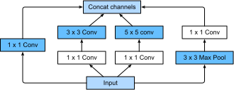
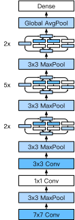
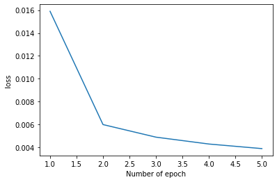
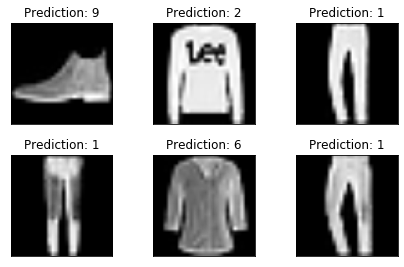

# Modern Convolutional Networks and there Implementation using Pytorch

## Sample data Used 
### Fashion MNSIT DataSet

## AlexNet Structure

### code
<code>
 class AlexNet(nn.Module):

    def __init__(self, num_classes=1000):
        super(AlexNet, self).__init__()
        self.features = nn.Sequential(
            nn.Conv2d(1, 64, kernel_size=11, stride=4, padding=2),
            nn.ReLU(inplace=True),
            nn.MaxPool2d(kernel_size=3, stride=2),
            nn.Conv2d(64, 192, kernel_size=5, padding=2),
            nn.ReLU(inplace=True),
            nn.MaxPool2d(kernel_size=3, stride=2),
            nn.Conv2d(192, 384, kernel_size=3, padding=1),
            nn.ReLU(inplace=True),
            nn.Conv2d(384, 256, kernel_size=3, padding=1),
            nn.ReLU(inplace=True),
            nn.Conv2d(256, 256, kernel_size=3, padding=1),
            nn.ReLU(inplace=True),
            nn.MaxPool2d(kernel_size=3, stride=2),
        )
        self.avgpool = nn.AdaptiveAvgPool2d((6, 6))
        self.classifier = nn.Sequential(
            nn.Dropout(),
            nn.Linear(256 * 6 * 6, 4096),
            nn.ReLU(inplace=True),
            nn.Dropout(),
            nn.Linear(4096, 4096),
            nn.ReLU(inplace=True),
            nn.Linear(4096, num_classes),
        )

    def forward(self, x):
        x = self.features(x)
        x = self.avgpool(x)
        x = torch.flatten(x, 1)
        x = self.classifier(x)
        return x

</code>

## VGG Structure

### code
<code>
 Sequential(
  (0): Sequential(
    (0): Conv2d(1, 64, kernel_size=(3, 3), stride=(1, 1), padding=(1, 1))
    (1): ReLU()
    (2): MaxPool2d(kernel_size=2, stride=2, padding=0, dilation=1, ceil_mode=False)
  )
  (1): Sequential(
    (0): Conv2d(64, 128, kernel_size=(3, 3), stride=(1, 1), padding=(1, 1))
    (1): ReLU()
    (2): MaxPool2d(kernel_size=2, stride=2, padding=0, dilation=1, ceil_mode=False)
  )
  (2): Sequential(
    (0): Conv2d(128, 256, kernel_size=(3, 3), stride=(1, 1), padding=(1, 1))
    (1): ReLU()
    (2): Conv2d(256, 256, kernel_size=(3, 3), stride=(1, 1), padding=(1, 1))
    (3): ReLU()
    (4): MaxPool2d(kernel_size=2, stride=2, padding=0, dilation=1, ceil_mode=False)
  )
  (3): Sequential(
    (0): Conv2d(256, 512, kernel_size=(3, 3), stride=(1, 1), padding=(1, 1))
    (1): ReLU()
    (2): Conv2d(512, 512, kernel_size=(3, 3), stride=(1, 1), padding=(1, 1))
    (3): ReLU()
    (4): MaxPool2d(kernel_size=2, stride=2, padding=0, dilation=1, ceil_mode=False)
  )
  (4): Sequential(
    (0): Conv2d(512, 512, kernel_size=(3, 3), stride=(1, 1), padding=(1, 1))
    (1): ReLU()
    (2): Conv2d(512, 512, kernel_size=(3, 3), stride=(1, 1), padding=(1, 1))
    (3): ReLU()
    (4): MaxPool2d(kernel_size=2, stride=2, padding=0, dilation=1, ceil_mode=False)
  )
  (5): Flatten()
  (6): Linear(in_features=25088, out_features=4096, bias=True)
  (7): ReLU()
  (8): Dropout(p=0.5, inplace=False)
  (9): Linear(in_features=4096, out_features=4096, bias=True)
  (10): ReLU()
  (11): Dropout(p=0.5, inplace=False)
  (12): Linear(in_features=4096, out_features=10, bias=True)
)
</code>

## NIN Structure

## network used
<code>
 Net(
  (n1): Sequential(
    (0): Conv2d(1, 96, kernel_size=(11, 11), stride=(4, 4))
    (1): ReLU()
    (2): Conv2d(96, 96, kernel_size=(1, 1), stride=(1, 1))
    (3): ReLU()
    (4): Conv2d(96, 96, kernel_size=(1, 1), stride=(1, 1))
    (5): ReLU()
  )
  (m1): MaxPool2d(kernel_size=3, stride=2, padding=0, dilation=1, ceil_mode=False)
  (n2): Sequential(
    (0): Conv2d(96, 256, kernel_size=(5, 5), stride=(1, 1), padding=(2, 2))
    (1): ReLU()
    (2): Conv2d(256, 256, kernel_size=(1, 1), stride=(1, 1))
    (3): ReLU()
    (4): Conv2d(256, 256, kernel_size=(1, 1), stride=(1, 1))
    (5): ReLU()
  )
  (m2): MaxPool2d(kernel_size=3, stride=2, padding=0, dilation=1, ceil_mode=False)
  (n3): Sequential(
    (0): Conv2d(256, 384, kernel_size=(3, 3), stride=(1, 1), padding=(1, 1))
    (1): ReLU()
    (2): Conv2d(384, 384, kernel_size=(1, 1), stride=(1, 1))
    (3): ReLU()
    (4): Conv2d(384, 384, kernel_size=(1, 1), stride=(1, 1))
    (5): ReLU()
  )
  (m3): MaxPool2d(kernel_size=3, stride=2, padding=0, dilation=1, ceil_mode=False)
  (dropout1): Dropout2d(p=0.5, inplace=False)
  (n4): Sequential(
    (0): Conv2d(384, 10, kernel_size=(3, 3), stride=(1, 1), padding=(1, 1))
    (1): ReLU()
    (2): Conv2d(10, 10, kernel_size=(1, 1), stride=(1, 1))
    (3): ReLU()
    (4): Conv2d(10, 10, kernel_size=(1, 1), stride=(1, 1))
    (5): ReLU()
  )
  (avg1): AdaptiveMaxPool2d(output_size=(1, 1))
  (flat): Flatten()
)
</code>

## Loss Vs Number Of epoch

## Prediction

#   GoogleNet
## Inception block

## Google Net Structure

## network used
<code>
 Sequential(
  (0): Sequential(
    (0): Conv2d(1, 64, kernel_size=(7, 7), stride=(2, 2), padding=(3, 3))
    (1): ReLU()
    (2): MaxPool2d(kernel_size=3, stride=2, padding=1, dilation=1, ceil_mode=False)
  )
  (1): Sequential(
    (0): Conv2d(64, 64, kernel_size=(1, 1), stride=(1, 1))
    (1): ReLU()
    (2): Conv2d(64, 192, kernel_size=(3, 3), stride=(1, 1), padding=(1, 1))
    (3): MaxPool2d(kernel_size=3, stride=2, padding=1, dilation=1, ceil_mode=False)
  )
  (2): Sequential(
    (0): Inception(
      (p1_1): Conv2d(192, 64, kernel_size=(1, 1), stride=(1, 1))
      (p2_1): Conv2d(192, 96, kernel_size=(1, 1), stride=(1, 1))
      (p2_2): Conv2d(96, 128, kernel_size=(3, 3), stride=(1, 1), padding=(1, 1))
      (p3_1): Conv2d(192, 16, kernel_size=(1, 1), stride=(1, 1))
      (p3_2): Conv2d(16, 32, kernel_size=(5, 5), stride=(1, 1), padding=(2, 2))
      (p4_1): MaxPool2d(kernel_size=3, stride=1, padding=1, dilation=1, ceil_mode=False)
      (p4_2): Conv2d(192, 32, kernel_size=(1, 1), stride=(1, 1))
    )
    (1): Inception(
      (p1_1): Conv2d(256, 128, kernel_size=(1, 1), stride=(1, 1))
      (p2_1): Conv2d(256, 128, kernel_size=(1, 1), stride=(1, 1))
      (p2_2): Conv2d(128, 192, kernel_size=(3, 3), stride=(1, 1), padding=(1, 1))
      (p3_1): Conv2d(256, 32, kernel_size=(1, 1), stride=(1, 1))
      (p3_2): Conv2d(32, 96, kernel_size=(5, 5), stride=(1, 1), padding=(2, 2))
      (p4_1): MaxPool2d(kernel_size=3, stride=1, padding=1, dilation=1, ceil_mode=False)
      (p4_2): Conv2d(256, 64, kernel_size=(1, 1), stride=(1, 1))
    )
    (2): MaxPool2d(kernel_size=3, stride=2, padding=1, dilation=1, ceil_mode=False)
  )
  (3): Sequential(
    (0): Inception(
      (p1_1): Conv2d(480, 192, kernel_size=(1, 1), stride=(1, 1))
      (p2_1): Conv2d(480, 96, kernel_size=(1, 1), stride=(1, 1))
      (p2_2): Conv2d(96, 208, kernel_size=(3, 3), stride=(1, 1), padding=(1, 1))
      (p3_1): Conv2d(480, 16, kernel_size=(1, 1), stride=(1, 1))
      (p3_2): Conv2d(16, 48, kernel_size=(5, 5), stride=(1, 1), padding=(2, 2))
      (p4_1): MaxPool2d(kernel_size=3, stride=1, padding=1, dilation=1, ceil_mode=False)
      (p4_2): Conv2d(480, 64, kernel_size=(1, 1), stride=(1, 1))
    )
    (1): Inception(
      (p1_1): Conv2d(512, 160, kernel_size=(1, 1), stride=(1, 1))
      (p2_1): Conv2d(512, 112, kernel_size=(1, 1), stride=(1, 1))
      (p2_2): Conv2d(112, 224, kernel_size=(3, 3), stride=(1, 1), padding=(1, 1))
      (p3_1): Conv2d(512, 24, kernel_size=(1, 1), stride=(1, 1))
      (p3_2): Conv2d(24, 64, kernel_size=(5, 5), stride=(1, 1), padding=(2, 2))
      (p4_1): MaxPool2d(kernel_size=3, stride=1, padding=1, dilation=1, ceil_mode=False)
      (p4_2): Conv2d(512, 64, kernel_size=(1, 1), stride=(1, 1))
    )
    (2): Inception(
      (p1_1): Conv2d(512, 128, kernel_size=(1, 1), stride=(1, 1))
      (p2_1): Conv2d(512, 128, kernel_size=(1, 1), stride=(1, 1))
      (p2_2): Conv2d(128, 256, kernel_size=(3, 3), stride=(1, 1), padding=(1, 1))
      (p3_1): Conv2d(512, 24, kernel_size=(1, 1), stride=(1, 1))
      (p3_2): Conv2d(24, 64, kernel_size=(5, 5), stride=(1, 1), padding=(2, 2))
      (p4_1): MaxPool2d(kernel_size=3, stride=1, padding=1, dilation=1, ceil_mode=False)
      (p4_2): Conv2d(512, 64, kernel_size=(1, 1), stride=(1, 1))
    )
    (3): Inception(
      (p1_1): Conv2d(512, 112, kernel_size=(1, 1), stride=(1, 1))
      (p2_1): Conv2d(512, 144, kernel_size=(1, 1), stride=(1, 1))
      (p2_2): Conv2d(144, 288, kernel_size=(3, 3), stride=(1, 1), padding=(1, 1))
      (p3_1): Conv2d(512, 32, kernel_size=(1, 1), stride=(1, 1))
      (p3_2): Conv2d(32, 64, kernel_size=(5, 5), stride=(1, 1), padding=(2, 2))
      (p4_1): MaxPool2d(kernel_size=3, stride=1, padding=1, dilation=1, ceil_mode=False)
      (p4_2): Conv2d(512, 64, kernel_size=(1, 1), stride=(1, 1))
    )
    (4): Inception(
      (p1_1): Conv2d(528, 256, kernel_size=(1, 1), stride=(1, 1))
      (p2_1): Conv2d(528, 160, kernel_size=(1, 1), stride=(1, 1))
      (p2_2): Conv2d(160, 320, kernel_size=(3, 3), stride=(1, 1), padding=(1, 1))
      (p3_1): Conv2d(528, 32, kernel_size=(1, 1), stride=(1, 1))
      (p3_2): Conv2d(32, 128, kernel_size=(5, 5), stride=(1, 1), padding=(2, 2))
      (p4_1): MaxPool2d(kernel_size=3, stride=1, padding=1, dilation=1, ceil_mode=False)
      (p4_2): Conv2d(528, 128, kernel_size=(1, 1), stride=(1, 1))
    )
    (5): MaxPool2d(kernel_size=3, stride=2, padding=1, dilation=1, ceil_mode=False)
  )
  (4): Sequential(
    (0): Inception(
      (p1_1): Conv2d(832, 256, kernel_size=(1, 1), stride=(1, 1))
      (p2_1): Conv2d(832, 160, kernel_size=(1, 1), stride=(1, 1))
      (p2_2): Conv2d(160, 320, kernel_size=(3, 3), stride=(1, 1), padding=(1, 1))
      (p3_1): Conv2d(832, 32, kernel_size=(1, 1), stride=(1, 1))
      (p3_2): Conv2d(32, 128, kernel_size=(5, 5), stride=(1, 1), padding=(2, 2))
      (p4_1): MaxPool2d(kernel_size=3, stride=1, padding=1, dilation=1, ceil_mode=False)
      (p4_2): Conv2d(832, 128, kernel_size=(1, 1), stride=(1, 1))
    )
    (1): Inception(
      (p1_1): Conv2d(832, 384, kernel_size=(1, 1), stride=(1, 1))
      (p2_1): Conv2d(832, 192, kernel_size=(1, 1), stride=(1, 1))
      (p2_2): Conv2d(192, 384, kernel_size=(3, 3), stride=(1, 1), padding=(1, 1))
      (p3_1): Conv2d(832, 48, kernel_size=(1, 1), stride=(1, 1))
      (p3_2): Conv2d(48, 128, kernel_size=(5, 5), stride=(1, 1), padding=(2, 2))
      (p4_1): MaxPool2d(kernel_size=3, stride=1, padding=1, dilation=1, ceil_mode=False)
      (p4_2): Conv2d(832, 128, kernel_size=(1, 1), stride=(1, 1))
    )
    (2): AdaptiveMaxPool2d(output_size=(1, 1))
    (3): Flatten()
  )
  (5): Linear(in_features=1024, out_features=10, bias=True)
)it 
</code>

## Loss Vs Number Of epoch

## Prediction

it 