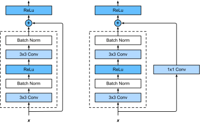
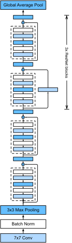
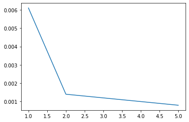
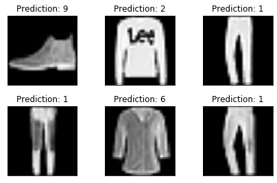

# ResNet
Consider F, the class of functions that a specific network architecture (together with learning rates and other hyperparameter settings) can reach. That is, for all f ∈ F there exists some set of parameters W that can be obtained through training on a suitable dataset. Let’s assume that f∗ is the function that we really would like to find. If it’s in F, we’re in good shape but typically we won’t be quite so lucky. Instead, we will try to find some fF∗ which is our best bet within F. For instance, we might try finding it by solving the following optimization problem:

                 fF∗ := argmin L(X,Y,f) subject to f ∈ F 

It is only reasonable to assume that if we design a different and more powerful architecture F′ we should arrive at a better outcome. In other words, we would expect that fF∗′ is ‘better’ than fF∗ . However, if F ̸⊆ F′ there is no guarantee that this should even happen. In fact, fF∗′ might well be worse. This is a situation that we often encounter in practice - adding layers doesn’t only make the network more expressive, it also changes it in sometimes not quite so predictable ways. The picture below illustrates this in slightly abstract terms.

#network structure

# LOSS Vs Number of epoch

# Prediction 
